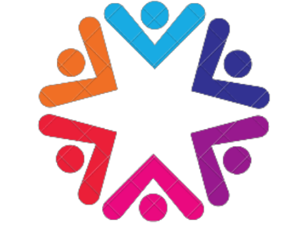
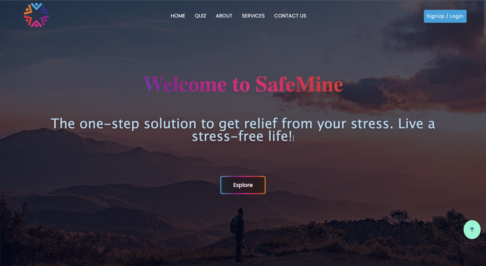
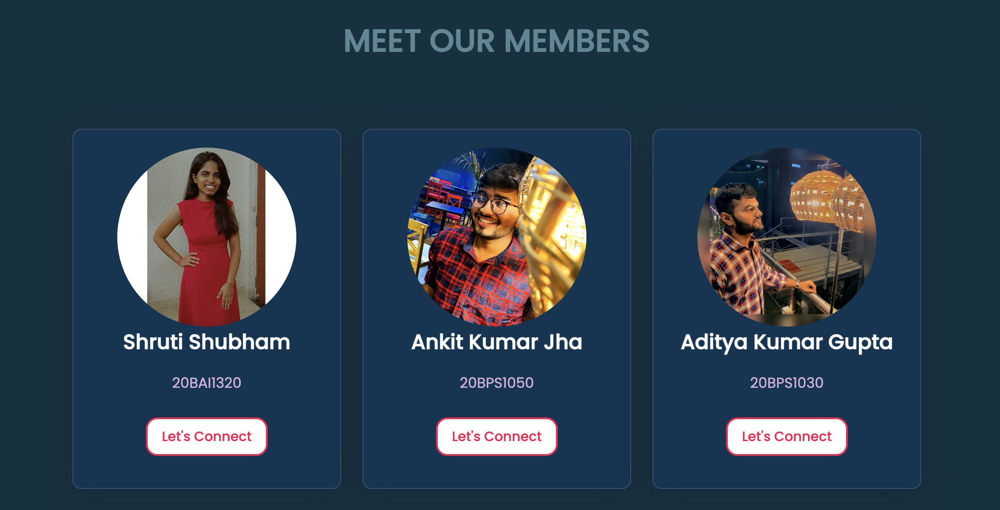

# SafeMine 
This is the project made under the TARP course.

## 📃 Description 
"Welcome to our stress-relieving website : [SafeMine](https://safemine.netlify.app/)! You'll find many useful materials here that may be applied to your daily life to make it less stressful. All of your stress-relief requirements, from carefully curated playlists and relaxing podcasts to essays and recommendations on stress management, are here in one convenient place. We've got you covered whether you need a little respite in the middle of a busy day at the office or a more extensive session after a long day. Explore our offerings, put them to the test, and let us know how we can better serve your needs. Don't forget that prioritising your own health and well-being is just as crucial as prioritising your work and objectives."

## Website Link-
<a href="https://safemine.netlify.app/">SafeMine</a>

## 🕊 Our Tagline 
The one step solution to get relief from your stress.
Live a stress-free life.

## 📝 Table of Contents
- [Problem it Solves](#problem_statement)
- [Services](#services)
- [Logo](#logo)
- [Screenshots](#screenshots)
- [Technology Stack](#tech_stack)
- [Contributors](#contributors)

## 🔎 Problems it Solves: 
- Gives mental peace 🧘‍♀️
- Reduces stress
- Refreshes mood
- Entertains people
- Motivates people
- Helps people to lead a healthy and succesful life.

## 💼 Our Services 
- Audio Therapy
- Reading Therapy
- Yoga Therapy
- Laughing Therapy
- Talking Therapy
- Consult A Doctor

## Our Logo 

## 📸 Screenshots 

## Tech Stack 

## Contributors 

